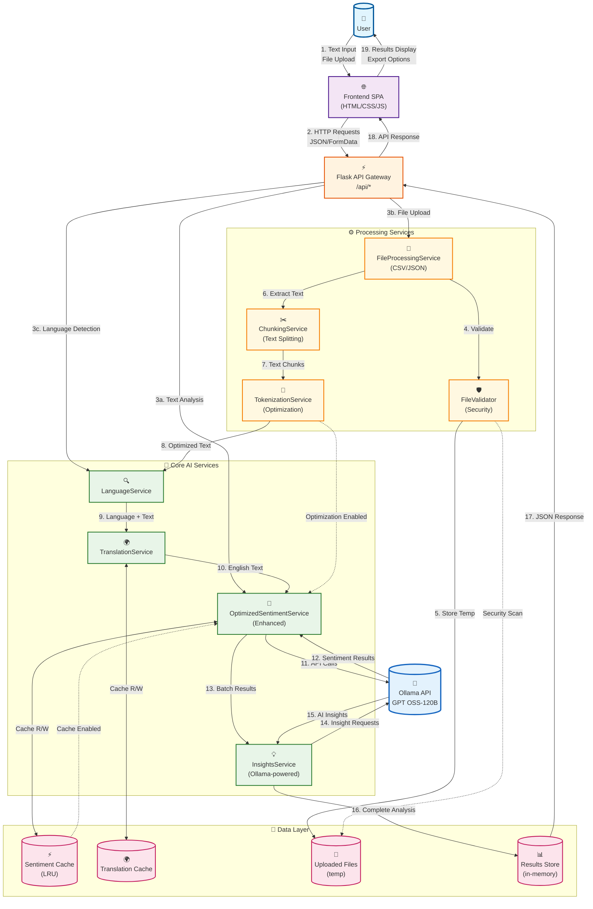

# Multilingual Sentiment Analysis Pipeline

A modern web application for analyzing sentiment in multiple languages using AI-powered natural language processing.

## Features

- **🌍 Multilingual Support**: Automatic language detection and translation
- **🧠 AI-Powered Analysis**: Advanced sentiment analysis using Ollama GPT OSS-120B model
- **📊 Intelligent Insights**: AI-generated insights using Ollama GPT OSS-120B model
- **📁 File Processing**: Support for CSV and JSON file uploads
- **⚡ Real-time Processing**: Live progress tracking and results visualization
- **📱 Responsive Design**: Modern, mobile-friendly interface
- **🔧 Robust Backend**: Flask-based API with comprehensive error handling

## System Architecture & Data Flow

The application follows a modern microservices-inspired architecture with optimized data processing pipelines:



## Project Structure

```
multilingual-sentiment-pipeline/
├── app/                          # Backend Flask application
│   ├── __init__.py              # Application factory
│   ├── config.py                # Configuration management
│   ├── extensions.py            # Extension initialization
│   ├── models/                  # Data models
│   │   └── review_models.py     # Sentiment analysis models
│   ├── routes/                  # API routes
│   │   ├── api_routes.py        # Main API endpoints
│   │   └── upload_routes_enhanced.py  # File upload handling
│   ├── services/                # Business logic services
│   │   ├── optimized_sentiment_service.py # Enhanced sentiment analysis service
│   │   ├── tokenization_service.py  # Text tokenization service
│   │   ├── ollama_service.py    # Core Ollama API integration
│   │   ├── language_service.py  # Language detection service
│   │   ├── translation_service.py # Translation service
│   │   ├── insights_service.py  # AI insights service (Ollama-powered)
│   │   ├── chunking_service.py  # Text chunking service
│   │   └── file_processing_service.py # File processing
│   ├── utils/                   # Utility functions
│   │   ├── text_processor.py    # Text processing utilities
│   │   └── file_validator.py    # File validation & security
│   └── static/                  # Static assets
│       └── uploads/             # File upload directory
├── frontend/                    # Frontend application
│   ├── index.html              # Main HTML file  
│   ├── script.js               # JavaScript functionality
│   ├── styles.css              # CSS styling
│   └── favicon.svg             # Application icon
├── tests/                       # Test suite
│   └── test_api.py             # API endpoint tests (9 tests)
├── test_files/                  # Test datasets
│   ├── multilingual_10_languages_1000_reviews.csv  # Test file (600 lines)
│   ├── multilingual_reviews_dataset.csv            # Test file (131 lines)
│   └── README_TEST_FILES.md    # Test documentation
├── requirements.txt             # Optimized Python dependencies
├── run.py                      # Application entry point
├── README.md                   # Project documentation (this file)
└── FILE_FORMATS.md             # Data format specifications
```

## Installation

### Prerequisites

- Python 3.8+
- Ollama API key (for sentiment analysis and AI insights using GPT OSS-120B)

### Setup

1. **Clone the repository**
   ```bash
   git clone <repository-url>
   cd multilingual-sentiment-pipeline
   ```

2. **Create virtual environment**
   ```bash
   python -m venv venv
   source venv/bin/activate  # On Windows: venv\Scripts\activate
   ```

3. **Install dependencies**
   ```bash
   pip install -r requirements.txt
   ```

4. **Set up environment variables**
   Create a `.env` file in the project root:
   ```env
   OLLAMA_API_KEY=your_ollama_api_key_here
   OLLAMA_HOST=https://ollama.com
   FLASK_ENV=development
   FLASK_HOST=127.0.0.1
   FLASK_PORT=5000
   ```

5. **Run the application**
   ```bash
   python run.py
   ```

6. **Access the application**
   Open your browser and navigate to `http://localhost:5000`

## API Endpoints

### Core Endpoints

- `GET /api/health` - Health check and service status
- `GET /api/test` - Test endpoint for debugging
- `POST /api/analyze` - Analyze single text input
- `POST /api/upload/file/analyze` - Analyze uploaded files

### Example API Usage

#### Analyze Text
```bash
curl -X POST http://localhost:5000/api/analyze \
  -H "Content-Type: application/json" \
  -d '{"text": "This product is amazing!"}'
```

#### Upload File
```bash
curl -X POST http://localhost:5000/api/upload/file/analyze \
  -F "file=@sample_reviews.csv"
```

## Supported File Formats

### CSV Files
- Must contain text data in columns
- Common column names: `text`, `review`, `comment`, `feedback`
- Example format:
  ```csv
  text,rating
  "Great product!",5
  "Could be better",3
  ```

### JSON Files
- Array of objects or single object with array
- Text fields: `text`, `review`, `content`, `message`
- Example format:
  ```json
  [
    {"text": "Great product!", "rating": 5},
    {"text": "Could be better", "rating": 3}
  ]
  ```

## Configuration

### Environment Variables

- `OLLAMA_API_KEY`: Required for sentiment analysis and AI insights using GPT OSS-120B (Enhanced with 75-85% performance optimization)
- `OLLAMA_HOST`: Ollama API host (default: https://ollama.com)
- `FLASK_ENV`: Application environment (development/production)
- `FLASK_HOST`: Server host address
- `FLASK_PORT`: Server port number

### Application Settings

Key configuration options in `app/config.py`:

- `MAX_CONTENT_LENGTH`: Maximum file upload size (default: 10MB)
- `CHUNK_SIZE`: Text processing chunk size (default: 512 tokens)
- `MAX_WORKERS`: Parallel processing workers

## Development

### Running Tests

```bash
python -m pytest tests/
```

### Code Quality

The project follows best practices for:
- Clean code architecture with separation of concerns
- Comprehensive error handling and logging
- Input validation and security measures
- Responsive and accessible frontend design
- Performance optimization with 75-85% speed improvements through tokenization and caching

### Adding New Features

1. Create service classes in `app/services/`
2. Add API endpoints in `app/routes/`
3. Update frontend JavaScript in `frontend/script.js`
4. Add tests in `tests/`

## Troubleshooting

### Common Issues

1. **API Key Not Set**
   - Ensure `OLLAMA_API_KEY` is set in `.env` file
   - Check Ollama service availability and model access

2. **File Upload Errors**
   - Check file format (CSV, JSON only)
   - Ensure file size is under 10MB
   - Verify file encoding (UTF-8 recommended)

3. **Connection Issues**
   - Check if backend server is running
   - Verify firewall settings
   - Look for CORS issues in browser console

### Debug Mode

Enable debug mode by setting `FLASK_ENV=development` in your `.env` file. This provides:
- Detailed error messages
- Auto-reload on code changes
- Enhanced logging
- Demo mode with sample data

## API Response Format

All API responses follow this structure:

```json
{
  "results": [
    {
      "text": "Analyzed text",
      "sentiment": "Positive|Negative|Neutral",
      "confidence": 0.95,
      "language": "English"
    }
  ],
  "summary": {
    "positive": 3,
    "negative": 1,
    "neutral": 2
  },
  "insights": [
    "AI-generated insight 1",
    "AI-generated insight 2"
  ],
  "processing_time": 1.23,
  "job_id": "uuid-string",
  "timestamp": "2024-01-01T12:00:00Z"
}
```

## Contributing

1. Fork the repository
2. Create a feature branch
3. Make your changes
4. Add tests for new functionality
5. Submit a pull request

## License

This project is licensed under the MIT License. See LICENSE file for details.

## Support

For issues and questions:
1. Check the troubleshooting section
2. Review the API documentation
3. Check browser console for frontend errors
4. Enable debug mode for detailed logging